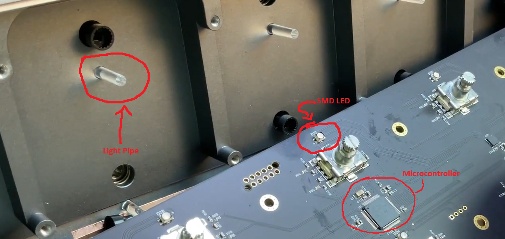
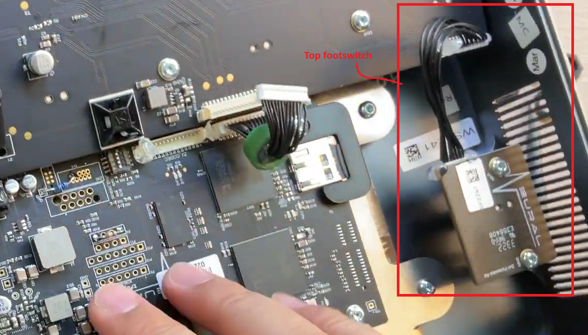
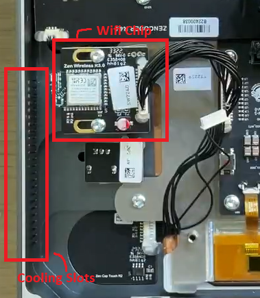
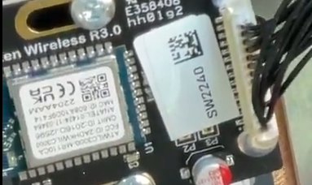

# Neural-DSP-QC Engineering notes

Any large files (MP4, prt, stp, etc.) are all located in my OneDrive folder (Katana-DSP/Engineering-Notes/).

## Table of contents
- [Neural-DSP-QC Engineering notes](#neural-dsp-qc-engineering-notes)
  - [Table of contents](#table-of-contents)
  - [Dimensions](#dimensions)
  - [Footswitches and LEDs](#footswitches-and-leds)
    - [Front panel LEDs (Ref: Neural DSP teardown video)](#front-panel-leds-ref-neural-dsp-teardown-video)
      - [Example parts on Mouser Electronics](#example-parts-on-mouser-electronics)
    - [SPST-Rotary encoder mechanism (Ref: Neural DSP teardown video)](#spst-rotary-encoder-mechanism-ref-neural-dsp-teardown-video)
    - [Microcontroller (Ref: Neural DSP teardown video)](#microcontroller-ref-neural-dsp-teardown-video)
  - [Wifi Chip (Ref: Neural DSP teardown video)](#wifi-chip-ref-neural-dsp-teardown-video)
  - [Font](#font)

## Dimensions

## Footswitches and LEDs

The top panel footswitch and LED control is connected via ribbon cable to the front panel control pcb.

### Front panel LEDs (Ref: Neural DSP teardown video)
The front panel LEDs are actually **SMD RGB-LEDs**. The light is then transmitted to the panel via so called *light pipes*.

The light pipes Neural DSP uses are colorless but diffused. Important for surface mount light pipes are *crushing ribs*, since they're self-locking.

#### Example parts on Mouser Electronics
* [LEDs](https://www.mouser.de/c/optoelectronics/led-lighting/led-emitters/standard-leds-smd/?illumination%20color=RGB&product=RGB%20LEDs)
* [Light pipes](https://www.mouser.de/c/optoelectronics/led-indication/led-light-pipes/?color=Water%2C%20Clear&number%20of%20elements=1%20Element&orientation=Vertical&product=Rigid%20Light%20Pipes)

### SPST-Rotary encoder mechanism (Ref: Neural DSP teardown video)

// TODO

### Microcontroller (Ref: Neural DSP teardown video)
The PCB uses a dedicated microcontroller (part indiscernible) to manage the LEDs and footswitches. It would probably be something like an *STM32F4* type of microcontroller due to high performance requirements of real-time switching. It might also use an external chrystal due to communication via USB or UART.

## Wifi Chip (Ref: Neural DSP teardown video)
The QC uses a [Microchip Technology: ATWILC3000-MR110CA](https://www.mouser.de/ProductDetail/Microchip-Technology/ATWILC3000-MR110CA?qs=9KdFJXLqUo%252BfAV4khUOwHQ%3D%3D) Wifi-Chip. It is positioned at the left hand side of the enclosure, next to the enclosures cooling slots. This is probably due to the enclosure shielding RF-frequencies and thus having a chance to pick up the signals via the slots.

Additional data on the top deck of the chips enclosure reads the following:

ATWILGJOCO MR110CA

FCC ID ZADHKWILC3000

ANATEL:01474-17-0346

CMIIT ID:20160./2596

MÁC ID:60841009F4144

2204AAM

CEEA

## Font
Neural DSP QC uses the [Spock Pro Regular](https://www.myfonts.com/de/products/pro-regular-spock-227764) font (by Los Andes)

